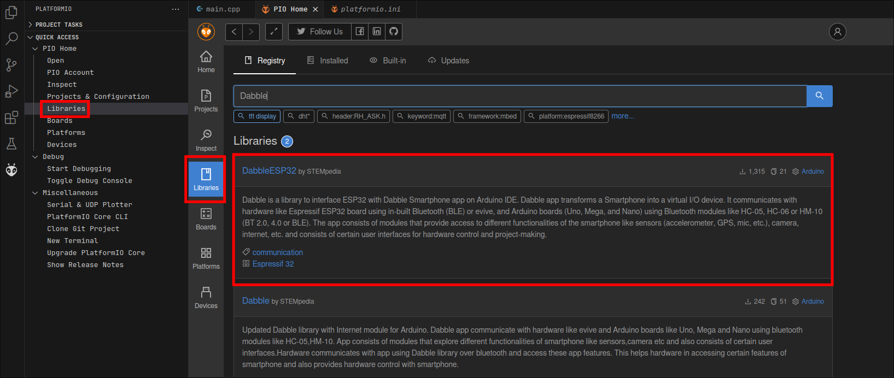

  
  # ProcessoSeletivo-Goytaborgs 
  

 

`Este projeto faz parte do processo seletivo da equipe Goytaborgs do IFF Campos centro.`

## Especificações do robo:
- Microcontrolador: `ESP32 DevKit`
- Ponte H (motor driver): `MX1508`
- 3 motores com caixa de redução
- Armadura em MDF 3mm 

## Software:
A programação desse sistema foi construida dentro do Ambiente do [PlataformIO](https://docs.platformio.org/en/latest/integration/ide/pioide.html).
A instalação desse IDE pode ser feita no gerenciador de extenções do [Visual Studio Code](https://code.visualstudio.com/).

Sinta-se a vontade para utilizar qualquer outro IDE que preferir, basta somente adicionar as biblitecas necessárias.

#### Dependencias:
No projeto foi utilizada a biblioteca [DabbleESP32](https://github.com/STEMpedia/DabbleESP32) para fazer a comunicação bluetooth entre o celular e o micro-controlador.
É necessário instalar o pacote de desenvolvimento para ESP32 dentro de seu IDE. Tanto no PlataforIO quanto no Arduino IDE é possível encontrar os downloads no gerenciador de pacotes.

Caso queira adicionar um núclio de terceiros:
- ESP32 core para arduino: [EspCore](https://raw.githubusercontent.com/espressif/arduino-esp32/gh-pages/package_esp32_index.json)

 

#### Instalação das dependências:
- Ambas as dependências podem ser baixadas no gerenciador de pacotes do PlataformIO e do arduino IDE

- **Selecione a opção que abrange sua placa. No caso desse projeto, utilizamos a `DOIT ESP32 DEVKIT v1`**

 

- Para arduino CLI:
  Se você estiver utilizando a ferramenta de terminal [Arduino CLI](https://arduino.github.io/arduino-cli/1.0/), pode inicar com esses passos:
  - Inincialize um arquivo de configuraçao: `$ arduino-cli config init`
  - Atualize o cache de plataformas: `$ arduino-cli core update-index`
  - Instale o nucleo: `$ arduino-cli board install esp32`
  - Para nucleos de terceiros, adicione o URL da "ESP32 core para arduino" em seu `arduino-cli.yaml`
  
  - (Leia a [documentação](https://arduino.github.io/arduino-cli/1.0/getting-started/) para infomrações detalhadas de uso no terminal ou Vim)

 

Após instalar todas as dependências, clone o repositório `$git clone https://github.com/Nauzoo/ProcessoSeletivo-Goytaborgs.git` e abra utilizando o PlataformIO ou copie o cógico `source/src/main.cpp` para seu IDE de preferência (não se esqueça de alterar a extenão .cpp para .ino caso necessário).
